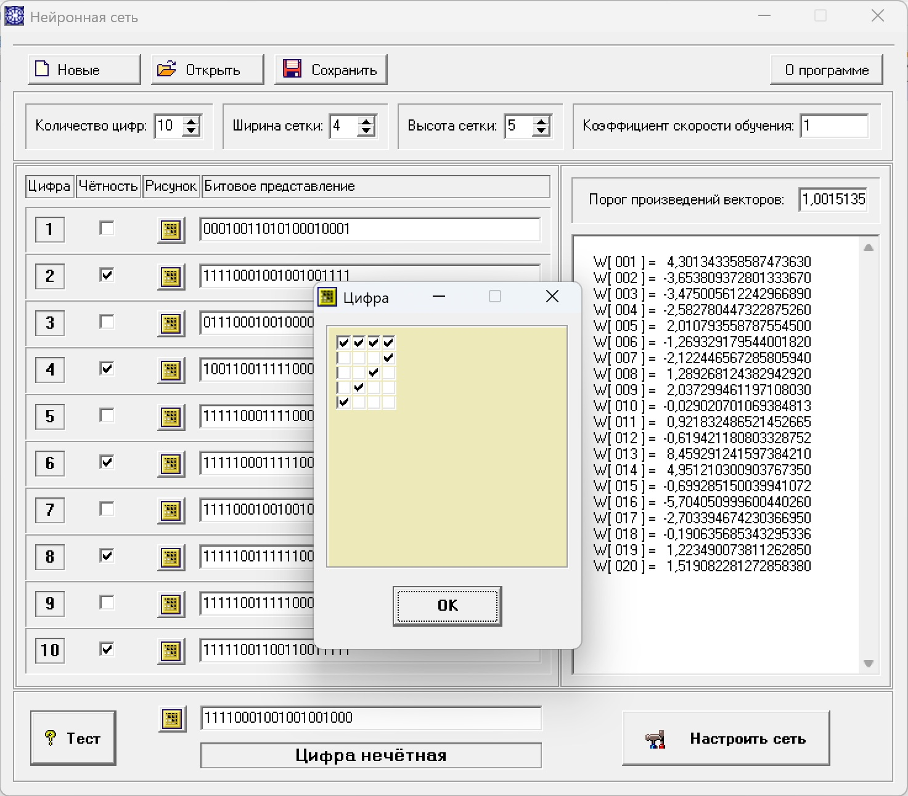

# Нейронная сеть чётности цифр (NeuronNet)

## Средства разработки
- **Язык программирования**: Object Pascal. 
- **Среда разработки**: Borland Delphi 7.

## Описание
Пользователь формирует набор цифр, проставляя их чётность, обучает нейросеть, задаёт произвольное значение и проверяет его на чётность.

Для цифр пользователь задаёт следующие значения:
- количество цифр;
- ширина сетки;
- высота сетки.

Для нейросети пользователь задаёт коэффициент скорости обучения.

Для каждой цифры пользователь задаёт:
- изображение;
- признак чётности.

Затем по кнопке "Настроить сеть" нейронная сеть настраивается и выдаёт свои парамметры в окне справа.

Внизу окна пользователь может ввести происзольное изображение и протестировать его: является ли оно чётной или нечётной цифрой.

Наборы данных можно сохранять, загружать и редактировать.

## Статус проекта
Проект завершён.

## Контакты
Котова Екатерина Александровна,
e-mail: katekotova_86@mail.ru